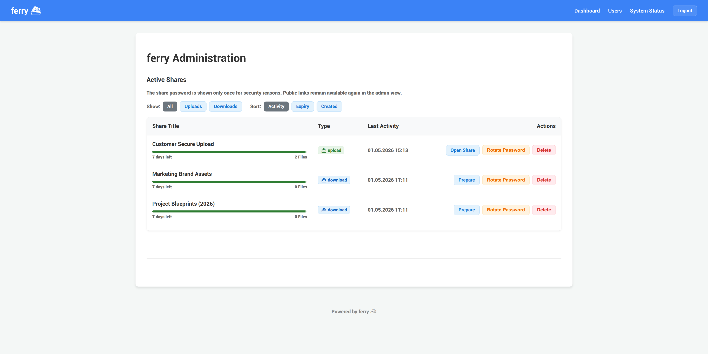
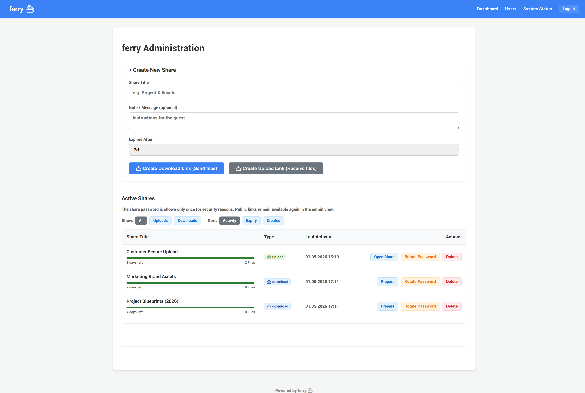
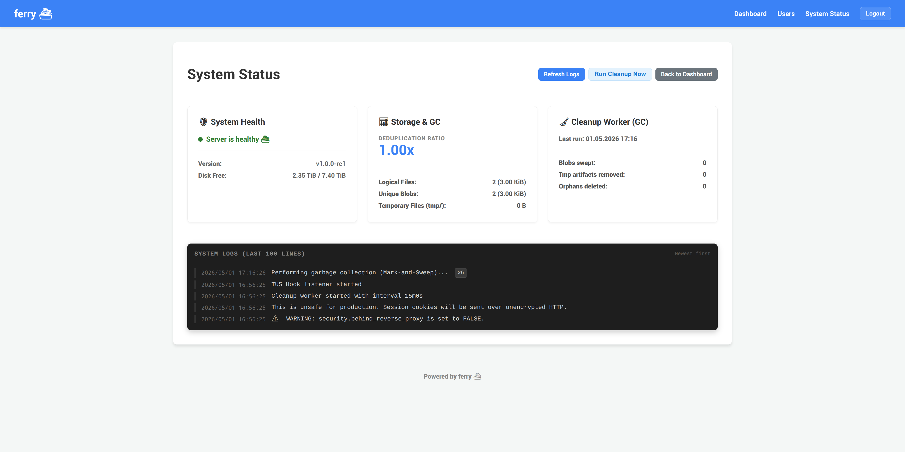
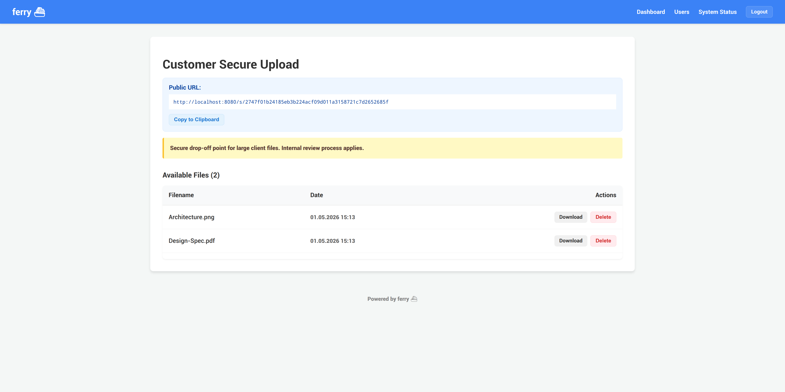

# ferry ⛴️

**ferry** is a self-hosted, single-binary file-sharing solution designed for simple and secure temporary file exchange. It features Content-Addressable Storage (CAS) for automatic deduplication and a modern web interface.



## ✨ Key Features
- 🚀 **Single Binary:** Go + SQLite. Zero external dependencies like Redis or S3.
- 📦 **Deduplication:** Automatic CAS-based deduplication saves disk space transparently.
- 📥 **Resumable Uploads:** Powered by the TUS protocol for reliable transfers.
- 🧪 **Dynamic UI:** Smooth, reload-free experience powered by HTMX and TUS.
- 🛡️ **Secure by Design:** Argon2id password protection, session hardening, and rate limiting.
- 🧹 **Automated Maintenance:** Built-in garbage collector (Mark-and-Sweep) for old shares and temporary files.
- 📱 **Responsive UI:** Clean, mobile-friendly dashboard and guest views.

### 🖼️ UI Gallery
| Admin Dashboard | System Status & Logs |
|:---:|:---:|
|  |  |

| Guest View (Download/Upload) |
|:---:|
|  |


## 🚀 Quick Start (Docker)
1. **Prepare configuration:**
   ```bash
   cp config.example.yaml config.yaml
   docker compose run --rm ferry ./ferry init-config
   # Then adjust config.yaml, especially server.public_url.
   ```
2. **Launch with Docker Compose:**
   ```bash
   docker compose up -d --build
   ```
3. **Setup:** Access your instance and follow the one-time `/setup` flow to create your admin account.

## 📖 Documentation
- [**Documentation Site**](docs/index.md) - Entry point for the published docs site.
- [**Operations Guide**](docs/OPERATIONS.md) - Deployment, Backup, and Recovery.
- [**Architecture**](docs/ARCHITECTURE.md) - Data model, CAS internals, and security design.
- [**Changelog**](CHANGELOG.md) - Release notes and compatibility-relevant changes.
- [**Release Checklist**](docs/RELEASE_CHECKLIST.md) - Quality gates for production readiness.
- [**Roadmap**](docs/ROADMAP.md) - Future plans (LDAP, Quotas, etc.).

## 🛠️ Development & Contributing
Contributions are welcome! Please see [CONTRIBUTING.md](CONTRIBUTING.md) for guidelines.

```bash
# Run tests
go test ./...
# Build locally
go build ./cmd/ferry
```

## 🔐 Security & Disclaimer
Ferry is a temporary file transfer tool, not a permanent file vault. Always run Ferry behind an HTTPS reverse proxy for production use. See [OPERATIONS.md](docs/OPERATIONS.md) for security best practices.

Please do not report critical security vulnerabilities through the public issue tracker. Send critical security reports to **kai@kaishome.de**; see [SECURITY.md](SECURITY.md).

---
*Powered by Go, SQLite, and ⛴️*
